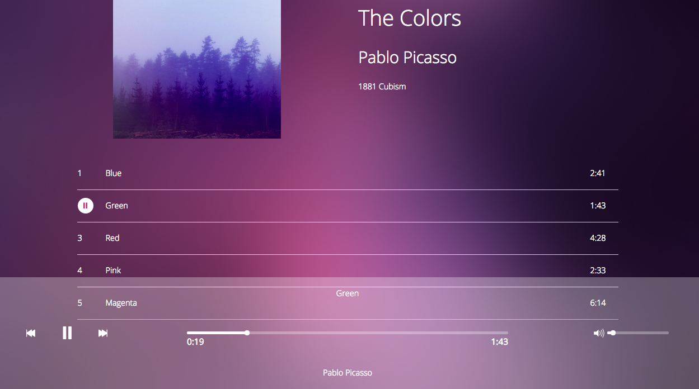

#BlocJams Angular.js
##A digital music player designed to learn frontend web development

BlocJams is a digital music player like [Spotify](https://www.spotify.com/us/), created as a means to learn frontend web development. It employs a user-friendly web interface to display and play songs. The mp3 files are accessed through BuzzFeed sounds and the application is built within an Angular framework.

